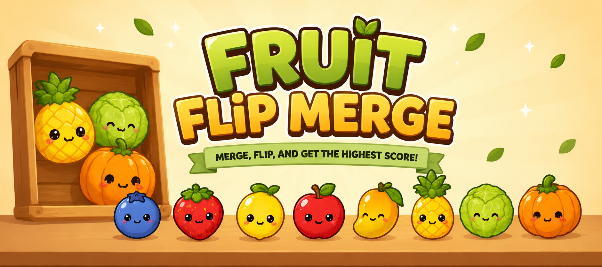
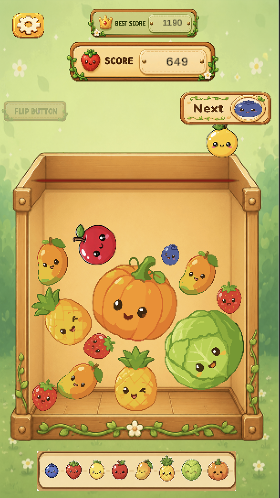
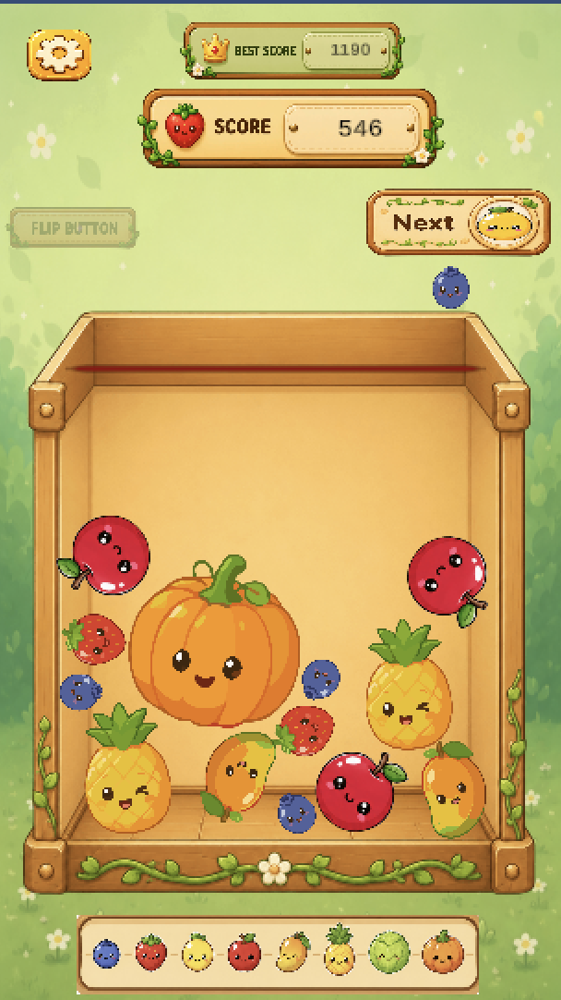
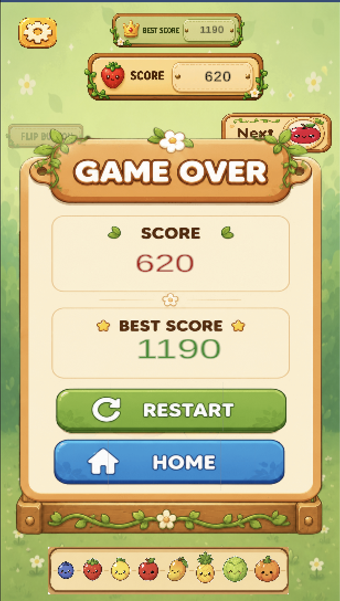

# Fruit Flip Merge

Fruit Flip Merge is a 2D mobile game developed in **Unity (C#)**.

The game is inspired by classic merge games, where players merge identical fruits to create larger fruits and increase their score. This project demonstrates gameplay programming, physics-based interactions, modular architecture, and a custom **Flip** mechanic designed to improve the player experience.

---

## Gameplay

### Key Features

- Merge identical fruits to create larger fruits.
- One-time **Flip** mechanic.
- Score system.
- Best Score saved using **PlayerPrefs**.
- Next Fruit Preview.
- Game Over system.
- Restart and Home buttons.
- Merge sound effect.
- Mobile touch controls (drag and release).
- Modular gameplay architecture.

---

## Gameplay Improvement

While playing merge games, I often noticed that small fruits became trapped underneath larger fruits. Once this happened, it became difficult to reach them, reducing merge opportunities and making the gameplay frustrating.

To solve this problem, I designed the **Flip** mechanic.

The player can use the Flip button **once per game** to flip all fruits vertically inside the box. This brings trapped fruits to the top, creates new merge opportunities, and adds a simple strategic decision instead of relying only on luck.

| Before Flip | After Flip |
|--------------|------------|
|  |  |

---

## Project Structure

The project is divided into independent systems to keep the code clean, modular, and easy to maintain.

| Script | Responsibility |
|---------|----------------|
| **FruitSpawner** | Spawns fruits, handles player input, and displays the next fruit preview. |
| **FruitMerge** | Detects collisions, merges fruits, creates higher-level fruits, and awards points. |
| **Fruit** | Stores fruit data such as the fruit level. |
| **ScoreManager** | Updates the current score and saves the best score using PlayerPrefs. |
| **FlipManager** | Controls the one-time Flip mechanic. |
| **GameOverTrigger** | Detects the losing condition. |
| **GameOverManager** | Displays the Game Over panel and handles the end of the game. |
| **AudioManager** | Plays the merge sound effect. |

---

## Design Decisions

The project follows a modular architecture where each gameplay system has a single responsibility.

Separating gameplay, UI, audio, and score management makes the project easier to maintain, debug, and expand with new gameplay features.

---

## User Experience

To make the gameplay more enjoyable and responsive, I added several feedback systems:

- Merge sound effect.
- Real-time score updates.
- Best Score saving using PlayerPrefs.
- Next Fruit Preview.
- Game Over panel.
- Home screen bounce animation.

